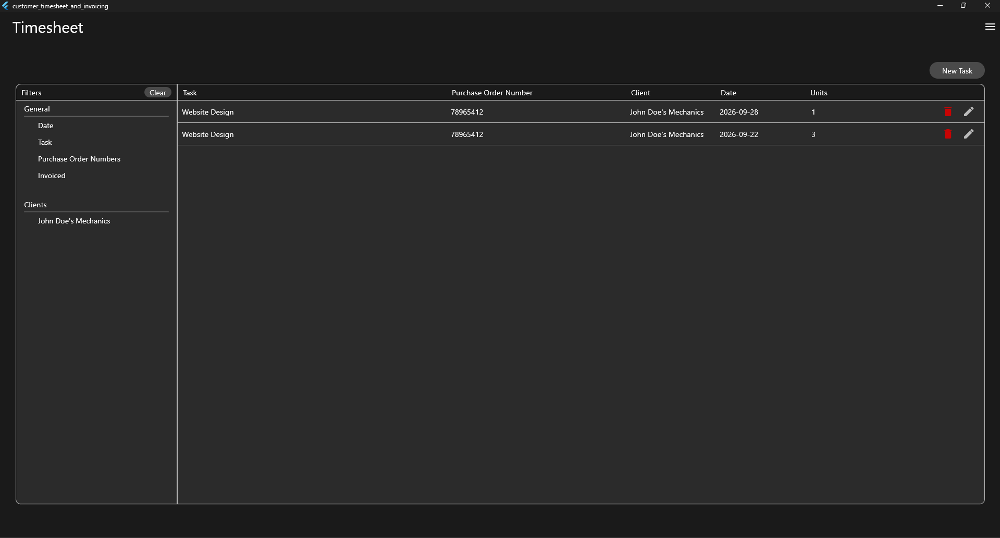

# Customer Invoicing and Timesheet Desktop Application

## Table of Contents

- [Overview](#overview)
- [Built With](#built-with)
- [Features](#features)
<!-- - [Contact](#contact) -->
<!-- - [Acknowledgements](#acknowledgements) -->

## Overview

This is a project for a client. The client requested a invoicing and time-sheet application that is more catered towards a sole proprietor. Thus with less features than bigger applications meant for corporations, and a simpler design. This application allows the user to keep track of their clients, their invoices sent, due and paid, and their tasks completed. The data is saved locally to avoid price increases that come with using cloud based storage.
 
This was the first time I had used Dart and Flutter to create an application, and it was a very educational experience. It is in some cases easier to use than something such as React Native, as there is less tweaking necessary to achieve the desired actions and style. However, this can become a limitation in some aspects, as it makes styling in more detail more complicated. 

### Built With

- Flutter
- Dart
- SQLite

## Features

- Task tracking on Home Page
- Client Recording
- Invoice and Statement Generation

<!-- ## Contact -->

<!-- ## Acknowledgements -->
